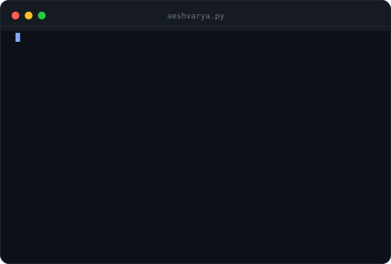

<!-- ═══════════════════════ BANNER ═══════════════════════ -->

<!-- ═══════════════════════ TYPING INTRO ═══════════════════════ -->

  

  
  
  
  

 

<!-- ═══════════════════════ SHORT VERSION ═══════════════════════ -->

  
  &nbsp;&nbsp;
  

 

<!-- ═══════════════════════ BUILDING ═══════════════════════ -->

 

| Project | What it is |
| :------ | :--------- |
| **AutoSetter** | AI-powered DSA problem setter — embeddings + vector search to kill duplicate problems, real-time collab over WebSockets |
| **3D Property Tours** | Video → Gaussian-splat pipeline for real-estate walkthroughs |
| **3D Portfolio** | Three.js galaxy with GSAP scroll-driven storytelling |
| **AI Automations** | LLM pipelines and agent loops on the Claude API + LangChain |

 

<!-- ═══════════════════════ ARSENAL ═══════════════════════ -->

 

 

  

 

<!-- ═══════════════════════ PROOF OF WORK ═══════════════════════ -->

  
  

  

 

  

 

  <picture>
    <source media="(prefers-color-scheme: dark)" srcset="https://raw.githubusercontent.com/Aeshvarya/Aeshvarya/output/github-snake-dark.svg" />
    <source media="(prefers-color-scheme: light)" srcset="https://raw.githubusercontent.com/Aeshvarya/Aeshvarya/output/github-snake.svg" />
    
  </picture>

 

<!-- ═══════════════════════ CREATOR ═══════════════════════ -->

 

I don't just write code — I document the whole journey. **31,000+ people** watch me grind, build, and level up in public.

  

 

<!-- ═══════════════════════ FOOTER ═══════════════════════ -->

 

<em>"Discipline is choosing between what you want now and what you want most."</em>

  

